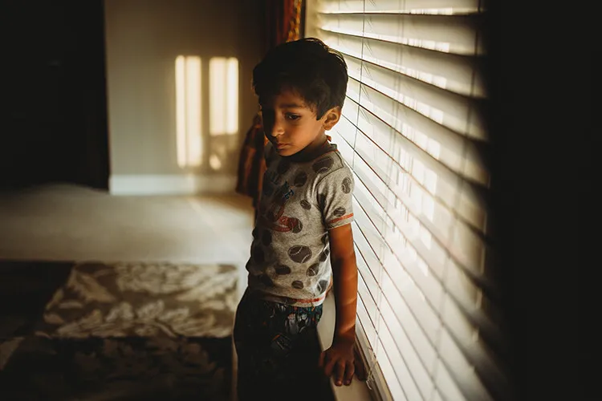
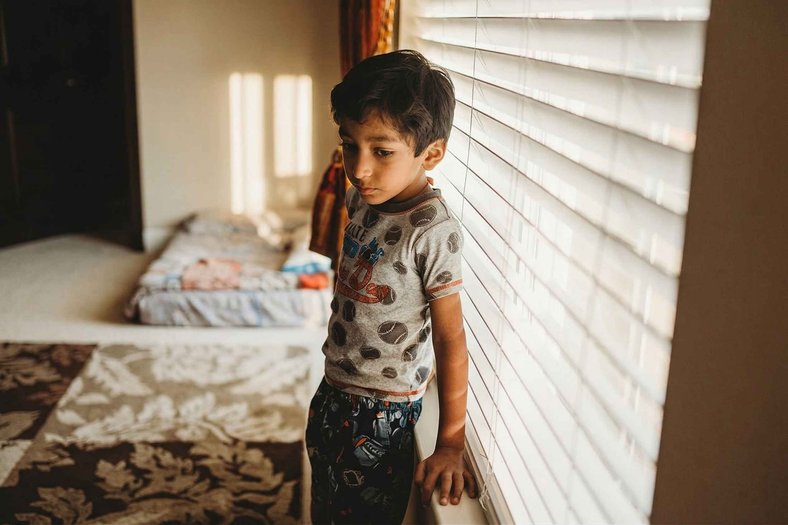

# 🌙 Low-Light Image Enhancement using Retinex-Based Illumination Modeling

## 📌 Overview
This project presents an implementation of low-light image enhancement techniques using illumination map estimation based on Retinex theory. The goal is to improve visibility in underexposed images while preserving structural details and avoiding noise amplification.

The system integrates two widely recognized approaches:
- LIME (Low-Light Image Enhancement)
- DUAL Illumination Estimation

Unlike basic brightness adjustment methods, this approach models the physical formation of images and performs optimization-based enhancement, resulting in more natural and visually consistent outputs.

---

## ✨ Motivation
Images captured in low-light conditions often suffer from:
- Loss of detail  
- Poor contrast  
- Noise amplification after naive enhancement  

This project addresses these issues by estimating the illumination component of an image and refining it using edge-preserving optimization techniques.

---

## 🚀 Features
- Enhances low-light images with realistic brightness  
- Based on Retinex theory (illumination-reflectance decomposition)  
- Supports both LIME and DUAL methods  
- Preserves edges and suppresses noise  
- Batch image processing via command line  
- Fully parameterized (gamma, lambda, sigma, etc.)  

---

## 🧠 Methodology

### 1. Illumination Map Estimation
- Initial illumination is estimated using the maximum RGB channel  
- Represents how light is distributed across the image  

### 2. Illumination Refinement
- Smoothness constraints applied using spatial affinity weights  
- Solved using a sparse linear optimization system  
- Preserves edges while removing noise  

### 3. Enhancement Techniques

#### 🔹 LIME
- Enhances underexposed regions using refined illumination map  

#### 🔹 DUAL
- Processes both:
  - Original image (underexposed regions)  
  - Inverted image (overexposed regions)  
- Combines results using exposure fusion  

### 4. Exposure Fusion
- Uses perceptual metrics:
  - Contrast  
  - Saturation  
  - Well-exposedness  

---


## 📊 Results

| Before | After |
|--------|-------|
|  |  |

## 🛠️ Tech Stack

### 👨‍💻 Programming Language
- Python 3.7+

### 📚 Libraries & Frameworks
- OpenCV → Image processing, filtering, and exposure fusion  
- NumPy → Efficient numerical computations and array operations  
- SciPy → Sparse matrix construction and linear system optimization  
- tqdm → Progress bar for batch processing  

### 🧠 Computer Vision Techniques
- Retinex Theory (illumination-reflectance decomposition)  
- Illumination Map Estimation  
- Gamma Correction  
- Multi-Exposure Fusion (Mertens Algorithm)  
- Edge-Preserving Smoothing  
- Gradient-Based Optimization  

### ⚙️ Mathematical & Optimization Concepts
- Sparse Linear Systems  
- Laplacian Matrix Construction  
- Gaussian Spatial Affinity Weights  
- Sobel Gradient Operators  
- Convolution-Based Filtering  

### 🧰 Tools & Environment
- VS Code / PyCharm  
- Git & GitHub (version control)  
- CLI-based execution (argparse)  

### 📁 Data Handling
- Image formats: JPG, PNG, BMP  
- Batch image processing using file I/O  

### 🖥️ Platform
- Works on Windows / Linux / macOS  
- CPU-based implementation (no GPU required)
---

## 📁 Project Structure
├── demo.py # Main script for running enhancement
├── exposure_enhancement.py # Core algorithms (LIME + DUAL)
├── utils.py # Helper functions
├── requirements.txt # Dependencies
├── demo/ # Input images
└── enhanced/ # Output results


---

## ⚡ Installation
```bash
pip install -r requirements.txt
```

💻 Usage
```bash
python demo.py -f ./demo/ -g 0.6 -l 0.15
``` 
Optional Arguments
--lime → Use LIME instead of DUAL
--gamma → Controls brightness correction
--lambda_ → Controls smoothness vs detail
--sigma → Spatial smoothing parameter

🎯 Applications
--Surveillance and security systems
--Autonomous driving vision
--Medical imaging preprocessing
--Photography enhancement
--Night-time object detection

🔮 Future Work
--GPU acceleration (CUDA / PyTorch)
--Real-time video enhancement
--Faster solvers (Fourier-based optimization)
--Deep learning hybrid models

📚 References
--LIME: Low-Light Image Enhancement via Illumination Map Estimation
--Dual Illumination Estimation for Robust Exposure Correction

Note
This project was developed as part of a Computer Vision coursework to explore illumination modeling, optimization techniques, and image enhancement pipelines.

⭐ Author
Aditya Telikicharla
